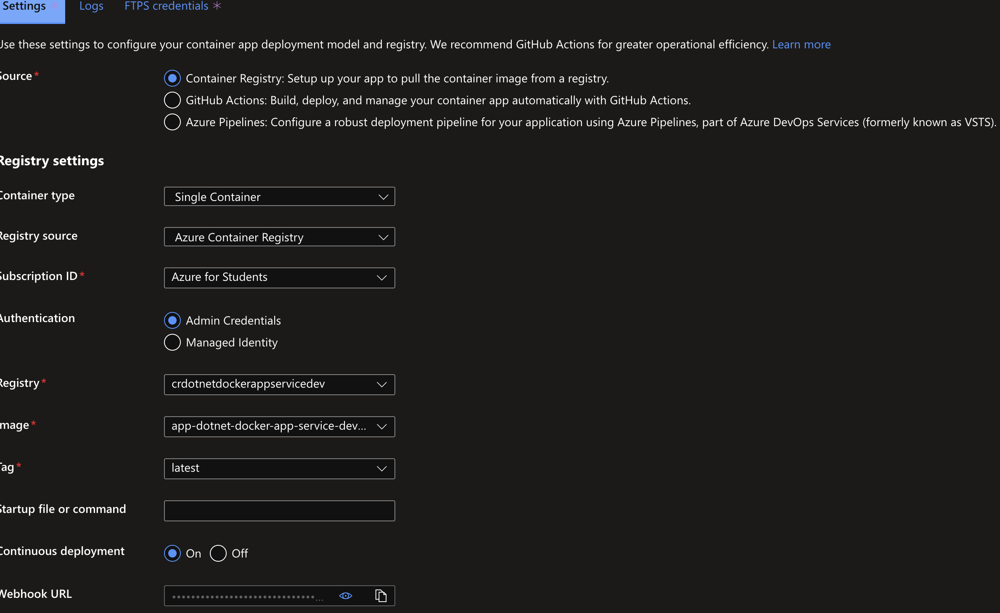

# .NET + Docker + Terraform + Azure

## **Prerequisites**

- .NET Core ≥ 6.0.0
- .NET Framework ≥ 4.8.0
- Docker ≥ 4.11.1
- Docker Compose ≥ 2.10.0
- Terraform ≥ 1.2.3
- Azure CLI ≥ 2.38.0

## **Installation**

- Windows
  - [.NET Core](https://dotnet.microsoft.com/en-us/download/dotnet/thank-you/sdk-6.0.403-windows-x64-installer)
  - [.NET Framework](https://dotnet.microsoft.com/en-us/download/dotnet-framework/net481)
  - [Docker](https://desktop.docker.com/win/main/amd64/Docker%20Desktop%20Installer.exe)
  - [Terraform](https://developer.hashicorp.com/terraform/tutorials/aws-get-started/install-cli)
  - [Azure CLI](https://aka.ms/installazurecliwindows)
- MacOS
  - .NET Core: **brew install dotnet**
  - Docker: **brew install docker**
  - Docker-Compose: **brew install docker-compose**
  - Terraform: **brew install terraform**
  - Azure CLI: **brew install azure-cli**
- Linux (Ubuntu / Debian)
  - [.NET Core](https://learn.microsoft.com/en-us/dotnet/core/install/linux-ubuntu#1604)
  - [Docker](https://www.digitalocean.com/community/tutorials/how-to-install-and-use-docker-on-ubuntu-16-04)
  - [Docker-Compose](https://www.digitalocean.com/community/tutorials/how-to-install-docker-compose-on-ubuntu-16-04)
  - [Terraform](https://developer.hashicorp.com/terraform/cli/install/apt)
  - [Azure CLI](https://learn.microsoft.com/en-us/cli/azure/install-azure-cli-linux?pivots=apt)

## **Usage**

- Authenticate using Azure CLI
  - `az —version`
  - if you’re using Azure Student subscription, make sure it’s created then run `az account set --subscription "YOUR_SUBSCRIPTION_ID”`
  - `az login --scope https://graph.microsoft.com//.default`
- Provision infrastructure using Terraform
  - `terraform -v`
  - `cd infrastructure`
  - `terraform init`
  - `terraform plan`
  - `terraform apply -auto-approve`
  - If you’re not planning to use provisioned infrastructure anymore, to avoid additional costs run `terraform destroy`
- Push Docker image to Azure Container Registry [[Guide](https://circleci.com/blog/deploy-dockerized-dotnet-core-to-azure/)]
  - `cd application`
  - `az acr build -t crdotnetdockerappservicedev.azurecr.io/app-dotnet-docker-app-service-dev/app-dotnet-docker-app-service-dev:v1.x.x -r crdotnetdockerappservicedev .` (Note that if you have new major version of an app it's a good practice to increment version tag of an image)
  - (Optional) Running docker image from ACR locally - `docker run -d -p 8080 crdotnetdockerappservicedev.azurecr.io/app-dotnet-docker-app-service-dev/app-dotnet-docker-app-service-dev`
- Deploy container on Azure App Service
  - Go to Azure Container Registry in Azure Console, Go to Deployment Center and enable Continuous Deployment (Also Continuous Deployment can be done using CricleCI / Github Actions platforms)
    
